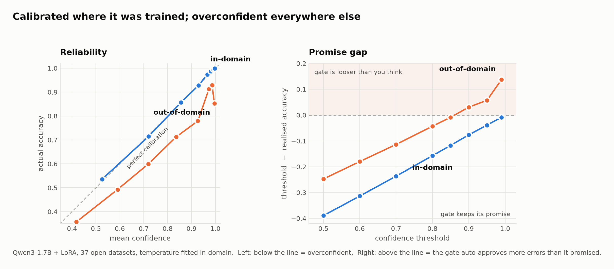

# jevlike — calibration under distribution shift for System One models

An open, reproducible replica of the [Jev](https://typesafe.ai/blog/introducing-system-one-models-and-jev)
"System One" decision-model shape: **state in, typed probabilistic decisions
out**, one forward pass, no decode loop.

Built to run one specific experiment that the public discussion around Jev
[explicitly identified as missing](https://github.com/SamuelSacco/jev-exploration):

> *"Calibration — the central claim with zero public evidence. This is the
> experiment that matters and it hasn't been run."*

So we ran it. **No API key required** — Qwen3-1.7B + LoRA + 37 open datasets,
MIT licensed, reproducible end to end on a single 12 GB consumer GPU.

---

## The finding

<picture>
  <source media="(prefers-color-scheme: dark)" srcset="docs/calibration-dark.png">
  
</picture>

A decision model's entire value proposition is *confidence gating*: "auto-handle
anything above 0.9, escalate the rest." That only works if the probabilities
mean what they say.

**In-domain, they do.** Confidence tracks accuracy almost exactly:

| mean confidence | actual accuracy | gap |
|---|---|---|
| 0.526 | 0.536 | −0.010 |
| 0.856 | 0.857 | −0.001 |
| 0.966 | 0.974 | −0.008 |
| **0.997** | **0.999** | −0.003 |

**Out-of-domain, they don't** — and the worst miscalibration is at the top:

| mean confidence | actual accuracy | gap |
|---|---|---|
| 0.418 | 0.357 | +0.061 |
| 0.719 | 0.600 | +0.120 |
| 0.927 | 0.779 | **+0.147** |
| **0.996** | **0.853** | **+0.143** |

Expected Calibration Error degrades **12×** — and the 95% bootstrap intervals
do not overlap, so this is not sampling noise:

```
in-domain   ECE 0.0085  [0.0070, 0.0161]   n = 9,496 slots, 31 task families
out-of-dom. ECE 0.1012  [0.0890, 0.1144]   n = 3,700 slots,  6 task families
```

### Tightening the threshold makes it worse

This is the part that matters operationally. The reflex fix for an untrusted
model is to raise the confidence gate. Here is what that actually does:

| threshold | in-domain accuracy | out-of-domain accuracy | **gap** |
|---|---|---|---|
| 0.80 | 0.957 | 0.843 | −0.043 |
| 0.85 | 0.967 | 0.859 | −0.009 |
| 0.90 | 0.976 | 0.869 | **+0.031** |
| 0.95 | 0.989 | 0.893 | **+0.057** |
| 0.99 | **0.999** | **0.853** | **+0.137** |

You validate a 0.99 gate in-domain and measure 99.85% accuracy. On a novel
input type the same gate delivers **85.3%**. The gate does not error, does not
warn — it silently auto-approves wrong decisions, and it is *most* wrong where
you told it to be *most* careful.

### Temperature scaling does not rescue it

Temperature scaling is the standard post-hoc calibration fix. Fitted on
in-domain data it works beautifully in-domain, and largely fails to transfer:

| | ECE at T=1.0 | ECE at T=1.19 |
|---|---|---|
| in-domain | 0.0212 | **0.0083** |
| out-of-domain | 0.1311 | 0.1011 |

---

## What is and isn't new here

**Not new:** that calibration degrades under distribution shift is well
established — see Ovadia et al., *"Can You Trust Your Model's Uncertainty?"*
(2019) and the literature since. No ML researcher should be surprised.

**New:**
1. Applied to this model class and the product claim built on it.
2. Measured on a fully open, API-key-free, reproducible stack — every other
   public calibration probe of Jev requires a TypeSafe key.
3. The operational framing: raising the gate threshold *increases* the silent
   failure rather than reducing it.

**Important scope limit:** these numbers come from *our 1.7B open replica*, not
from Jev itself. We make no claim about Jev's calibration. What we show is that
a model of this shape, trained this way, behaves this way.

---

## Beyond text: the same gate on manufacturing sensor data

Is the finding specific to text and LLMs? We asked the same question where
confidence gating is called *virtual metrology*: predict quality from process
sensors, auto-release what the model is sure about, physically measure the
rest. Here the shift is not constructed — it is time. Full chronological log,
including wrong turns and corrections: [`docs/secom-log.md`](docs/secom-log.md).

### SECOM: the failure changes shape

UCI SECOM, 1,567 wafers, 590 sensors. Train on the first 60% of the period,
test on the last 40%.

| | early period | later period |
|---|---|---|
| accuracy | 0.911 | 0.947 |
| ECE | 0.042 | 0.060 |
| AUC | 0.664 | **0.512** |
| fail rate among released | 3.7% | 5.0% |
| fail rate among held back | 12.2% | 3.9% |

Accuracy goes up and ECE barely moves, because the failure rate falls.
Meanwhile ranking drops to chance and the gate stops selecting. On text the
failure was overconfidence, visible in ECE; here it is a ranking collapse that
ECE does not see.

- **It is not the model.** 28 models from 9 families under one protocol
  (boosted trees, TabPFN, MLPs, sequence models, the fine-tuned Qwen3 itself):
  none exceeds AUC 0.59 in the later period, none beats "always answer pass".
- **It is temporal.** With a same-size random split the held-out AUC is
  0.57–0.70; chronologically it is 0.45–0.55. The ranges do not overlap.
- **A drift alarm does not help.** It is sound and never stops ringing: every
  week of this line is distinguishable from every other.
- **Retraining does not help either.** Retraining every 100 wafers does not
  beat a frozen model.

### Gas sensor drift: miscalibration and gate failure are different events

UCI Gas Sensor Array Drift, 13,910 measurements over 36 months in ten batches.
Trained on batches 1–3, every later batch scored separately. Five seeds.

| batch | accuracy | mean confidence | ECE | accuracy above the 0.99 gate |
|---|---|---|---|---|
| in-domain | 0.990 | 0.985 | 0.008 | 0.998 |
| 4 | 0.814 | 0.965 | 0.151 | **0.893** |
| 6 | 0.758 | 0.857 | 0.119 | 0.994 |
| 7 | 0.662 | 0.810 | 0.155 | 0.999 |
| 9 | 0.633 | 0.773 | 0.156 | 1.000 |
| 10 | 0.500 | 0.873 | 0.373 | **0.857** |

The overconfidence is the text result again, on sensors: in the last batch the
model is 87% confident and 50% right. The gate is a different story. In
batches 6, 7 and 9 the model has lost a third of its accuracy and the gate
still keeps its promise, by releasing far fewer items. In batches 4, 8 and 10
it breaks. One part of the text result is *not* reproduced: the gap does not
clearly grow as the threshold is tightened.

### Validation does not tell you which gate will break

50 training runs of the same pipeline, indistinguishable in validation:

| quantity | mean | min | max |
|---|---|---|---|
| in-domain accuracy | 0.990 | 0.987 | 0.992 |
| later accuracy | 0.635 | 0.622 | 0.649 |
| later error among released | 0.063 | 0.030 | **0.176** |

- The gate's own error in validation is uncorrelated with its error later
  (Spearman +0.20, p = 0.16) — at three thresholds and for two model families.
- Averaging five runs removes the lottery (worst case 0.217 → 0.030 at equal
  share released) but does not fix the gate: batches 4, 8 and 10 defeat every
  run.
- Model choice matters more than run choice, and validation is blind to both:
  MLP and boosted trees validate identically, and after drift the trees' gate
  is five times worse (0.264 against 0.052).

### A label-free signal for *harmful* drift

A drift detector answers "has the data changed?", and the answer is always
yes. Disagreement between the deployed run and four companion runs, on the
items it releases, separates broken gates from intact ones:

| free signal | MLP, 0.99 gate | trees, 0.99 gate |
|---|---|---|
| disagreement among released, AUC | **0.926** | 0.797 |
| share released, AUC | 0.519 | 0.494 |
| mean confidence, AUC | 0.435 | 0.474 |
| drift detector, AUC | 0.500 | 0.500 |

It ranks, it does not measure: disagreement is 5–20× smaller than the true
error, because the runs mostly make the same mistakes. And it fails when the
companions are not independent — boosted trees are wrong on 35% of released
items in batch 6 and disagree on 0.2%.

### What is and isn't new in this part

**Not new:** SECOM's collapse under time-ordered validation has been published
by others; auditing released items to detect harmful shift is Podkopaev and
Ramdas (2022) and, in virtual metrology, the Reliance Index and sampling
decision schemes; disagreement as an error signal is Jiang et al. (2022).
Both of the first two were checked *after* the work was done — the log says so.

**Not found elsewhere in a brief search:** the 28-model comparison under one
protocol with a same-size random-split control, the 50-run study of which gate
breaks, and disagreement applied to a confidence gate under real sensor drift.
Only abstracts were read.

---

## How it works

We did **not** design a new architecture. Qwen3-1.7B is used unmodified; the
System One behaviour is an inference protocol plus a loss function.

```
standard causal decoder (Qwen3-1.7B, unmodified)
  └─ answer slots embedded in the prompt
  └─ hidden states gathered at slot positions      -> [B, K, H]
  └─ only the 52 letter rows of lm_head            -> [B, K, 52]
  └─ single forward pass, no decode loop
```

The prompt carries the state once and every question's answer slot lives in the
same sequence, so causal masking gives all K answers from one pass:

```
<state>
{...}
</state>

Questions:
1. Which department should handle this?
   (A) billing
   (B) technical_support
2. Is the customer asking for a refund?
   (A) no
   (B) yes

Answers:
1) (-
2) (-
```

Logits at the `(` token predict the option letter. The real answer is never
written into the sequence — it is only read out.

### Two things worth stealing

**The 52-letter readout.** Every answer is one of 52 single-token letters, so
the vocabulary dimension can leave the computation entirely. We never
materialise `[B, L, V]` (V = 151,936; that is ~600 MB for a single 2k-token
example). Same path is used for training, where gradients are only needed at
the slots anyway.

**The sentinel, and why slot alignment must be asserted.** Qwen3's
pre-tokenizer merges punctuation followed by whitespace: writing `"1) (\n"`
produces `" (\n"` as a *single token*, so logits at that position predict what
comes after the newline rather than the option letter. This fails silently and
would corrupt everything downstream. We place a non-whitespace sentinel (`-`)
after each slot and verify alignment via the tokenizer's offset mapping,
raising `PromptError` if it ever breaks.

### Type safety

The schema is fixed in advance, so the model cannot return anything outside it.
That guarantee comes from `schema.py`, **not from the model** — and it
guarantees *format validity, not truth*. We use "no hallucination" only in that
narrow sense.

---

## Calibration training

Loss = `CE + 0.5 · Brier`.

Cross-entropy is insatiable: pushing 0.99 → 0.999 is still rewarded, so the
model learns confidence far beyond its accuracy. The untrained base model is a
clean demonstration — it needs a temperature of **8.881** to become calibrated,
i.e. its logits must be divided by nearly 9.

Brier is a bounded proper scoring rule: it pulls the whole distribution toward
reality and penalises over-sharpening. This is our open-source stand-in for
TypeSafe's unpublished RLCD. We claim no equivalence; the measurable goal is the
same — probabilities that track accuracy.

Temperature scaling runs afterwards as a separate step. Brier fixes the shape;
temperature closes the residual systematic offset.

---

## Full results

Qwen3-1.7B + LoRA (r=32, attention-only), 2000 steps, **65.7 min** on an
RTX 5070 Ti Laptop (12 GB). Macro = averaged per task family, not per slot.

### Base vs fine-tuned

| | in-domain | | out-of-domain | |
|---|---|---|---|---|
| | base | **LoRA** | base | **LoRA** |
| accuracy (macro) | 0.641 | **0.854** | 0.566 | **0.697** |
| ECE (macro) | 0.172 | **0.053** | 0.146 | **0.100** |
| Brier (macro) | 0.489 | **0.208** | 0.549 | **0.415** |
| calibration T | 8.881 | **1.079** | | |

Raw confidence before any temperature correction:

| | accuracy | mean confidence | overconfidence |
|---|---|---|---|
| base, out-of-domain | 0.554 | 0.953 | **+0.399** |
| LoRA, in-domain | 0.897 | 0.903 | +0.006 |

The base model answers with 95% confidence at 55% accuracy. What fine-tuning
buys is not mainly accuracy — it is **making the confidence number usable**.

### Micro vs macro: your ECE may be measuring your eval mix

| set | slots | tasks | micro ECE | macro ECE | ratio |
|---|---|---|---|---|---|
| in-domain | 9,496 | 31 | 0.0085 | 0.0540 | **6.3×** |
| out-of-domain | 3,700 | 6 | 0.1012 | 0.1102 | 1.1× |

Averaging per slot lets the largest, easiest task family carry the number. In an
earlier run of this repo a single dataset was 31% of eval slots and the micro
ECE read **10× better** than the macro one. Any single ECE figure over a mixed
eval should be treated as a property of the eval, not the model.

### Latency

```
questions per request (mean) : 11.53
single pass                  :  113 ms
one pass per question        :  651 ms
speedup                      : 5.75x
```

Base model measures 109 ms, LoRA 113 ms — **the speed does not come from
training.** It is entirely the single-pass design, and LoRA is merged back into
the base at inference so it adds no overhead.

### A negative result we are reporting anyway

The multi-label sources were badly over-weighted: because loss is computed per
slot, `go_emotions` (expanded to 16 questions per example) drove **27%** of the
gradient from **2.6%** of the examples. Together with `civil_comments`, 5% of
examples drove 38% of the gradient.

We fixed it (16 → 4 and 7 → 3 questions per example) and retrained. Evaluated on
an identical eval set, the difference was **within noise**:

| | v1 (imbalanced) | v2 (balanced) | bootstrap CI width |
|---|---|---|---|
| in-domain macro acc | 0.8533 | 0.8585 | ±0.013 |
| in-domain macro ECE | 0.0538 | 0.0547 | ±0.009 |
| out-of-dom. macro acc | 0.6938 | 0.6856 | ±0.029 |

The imbalance was a **measurement** problem, not a model problem: the same model
scored 0.8922 on the skewed eval and 0.8677 on the balanced one.

---

## Data

37 open datasets → 95,757 examples / 108,257 labelled decisions. All public on
the HF Hub, no gated sets, **no distillation from frontier models** — labels are
the datasets' own human annotations. Full source list and field mappings:
[`src/jevlike/data/registry.py`](src/jevlike/data/registry.py).

Two augmentations are load-bearing:

**Menu subsampling.** Showing a 77-class intent dataset with all 77 options
every time produces a fixed classifier. Instead each example gets a
random-sized submenu that always contains the gold answer. The goal is a
decision engine that *takes its categories as input* and works on menus it has
never seen. Not applied to `score` (ordered levels) or `bool` (the
`options[1] == true` convention).

**Order shuffling.** Options are re-ordered per example, otherwise the model
learns position priors like "A is usually right."

**Held-out groups.** Six task families are never trained on — `commonsense`,
`climate`, `newsgroups`, `tr_scenario`, `safety_chat`, `finance`. Generalisation
is measured there; training and evaluating on the same family would leak.

Where a dataset has no separate test split, eval rows are taken from the **end**
of the split, otherwise train and eval share the same first N rows.

Question prompts are in Turkish while most datasets are English. This is
deliberate: the menu and the question are the *interface*, and keeping them in a
different language from the data forces the model to treat options as arbitrary
strings rather than memorised labels. Turkish-native sets (MASSIVE-tr, Turkish
product reviews and sentiment) are included in the mixture.

---

## Install

```bash
uv sync --extra dev
```

Blackwell (RTX 50xx, sm_120) needs torch cu128; `pyproject.toml` pins it.

## Use

```bash
# build the data mixture (~10 min including dataset downloads)
uv run python -m jevlike.data.build --out data

# train (~66 min for 2000 steps on a 12 GB laptop GPU)
uv run python -m jevlike.train --data-dir data --max-steps 2000 --batch-size 16 \
    --out-dir runs/qwen3-1.7b

# evaluate: per-task and per-group breakdown, pre/post temperature, latency
uv run python -m jevlike.evaluate --adapter runs/qwen3-1.7b/adapter \
    --latency --dump-predictions runs/preds.jsonl

# the calibration study: micro vs macro, reliability, gate analysis, bootstrap CIs
uv run python scripts/calibration_study.py --predictions runs/preds.jsonl \
    --temperature 1.19

# TypeSafe's public workflow eval (fetches from evals.typesafe.ai, no key needed)
uv run python scripts/typesafe_eval.py --adapter runs/qwen3-1.7b/adapter

# serve: /decide and a Jev-compatible /v1/systemone
uv run python -m jevlike.serve --adapter runs/qwen3-1.7b/adapter
```

Run `evaluate.py` without `--adapter` for the untrained baseline.

### Sensor studies

The data is not downloaded automatically. Unzip the two UCI archives so that
the files land here:

| archive | expected layout |
|---|---|
| [secom.zip](https://archive.ics.uci.edu/static/public/179/secom.zip) | `data/secom/secom.data`, `data/secom/secom_labels.data` |
| [gas+sensor+array+drift+dataset.zip](https://archive.ics.uci.edu/static/public/224/gas+sensor+array+drift+dataset.zip) | `data/gas/Dataset/batch1.dat` … `batch10.dat` |

The extra
libraries (scikit-learn, LightGBM, XGBoost, CatBoost, TabPFN) are in the `dev`
dependency group, which `uv sync` installs by default.

```bash
# SECOM: main study, the random-split control, then all architectures
uv run python scripts/secom_study.py
uv run python scripts/secom_study.py --random-split
uv run python scripts/secom_archs.py
uv run python scripts/secom_seq.py
uv run python scripts/secom_llm.py          # needs the GPU
uv run python scripts/secom_drift.py
uv run python scripts/synth_wafers.py       # simulator: one kind of shift at a time

# gas sensor drift: main study and control
uv run python scripts/gas_study.py
uv run python scripts/gas_study.py --random-split --out runs/gas/preds_control.jsonl

# 50 runs per model (cached to runs/gas/*.npz), then the disagreement signal
uv run python scripts/gas_seeds.py
uv run python scripts/gas_seeds.py --arch gbdt --cache runs/gas/seeds_gbdt.npz
uv run python scripts/gas_disagreement.py

# audit rate needed to notice a failed gate; blocked-in-time checks for both datasets
uv run python scripts/gas_audit.py
uv run python scripts/forward_checks.py
```

```python
from jevlike.schema import Question
from jevlike.scorer import LetterSlotScorer, ScorerConfig

scorer = LetterSlotScorer(ScorerConfig(adapter_path="runs/qwen3-1.7b/adapter"))

d = scorer.decide(
    {"subject": "Charged twice on my card", "body": "..."},
    [
        Question.choice("department", "Which team should handle this?",
                        ["billing", "technical_support", "sales", "spam"]),
        Question.boolean("refund", "Is the customer asking for a refund?"),
        Question.score("urgency", "How urgent is this?", lo=1, hi=5),
    ],
)
d["department"].best          # 'billing'
d["department"].confidence    # calibrated in-domain, over-confident out of it
d["urgency"].expected_value([1, 2, 3, 4, 5])
```

Three questions, one forward pass.

## Tests

```bash
uv run python -m pytest tests/ -q
```

Most tests target *silent* failure modes rather than crashes: slot
misalignment, mask leakage, position bias in menu subsampling. Three real bugs
were caught this way during development — a tokenizer merge that moved every
readout position, a train/eval split overlap, and unanswerable questions with
duplicate options.

---

## Limitations

- **Six held-out families is a small sample** of the space of task families.
  This is the main weakness of the headline result; more families would
  strengthen it considerably.
- **Results are from a 1.7B open replica**, not from Jev. No claim is made
  about Jev's calibration.
- **Our run of TypeSafe's public eval** (n=181 pairs, `invoice_processing`
  excluded for context length) is too small to stand on its own. Note also that
  its reference answers are the mean of GPT-6 Astra and Fable 5.1 probabilities
  — agreement with frontier models, *not* ground truth.
- **52 options per question**, set by the single-token letter readout. Higher
  cardinality needs chunking; currently raises `SchemaError` rather than
  silently truncating.
- **Calibration is group-level**: "90% of the answers it labels 0.9 are right",
  not "this particular answer is 90% likely to be right." TypeSafe states the
  same limitation.
- **The sensor results rest on two small datasets.** SECOM has 28 failures in
  the later period. Everything about seed instability and disagreement comes
  from the gas dataset alone, with one "broken gate" bar (5% error among
  released items). No hyperparameter search was done for any sensor model.
- **In-domain sensor scores are optimistic.** They come from random folds, and
  drift is already present inside the training period: on gas, leaving a whole
  batch out gives 0.79–0.98 instead of 0.992. It is the number an operator
  would see before deploying, not a clean baseline.
- **Text input only** for the decision model (string, JSON object, list of
  text). The sensor studies use small tabular models, except one run that
  feeds 30 sensors to the LLM as text.
- **Causal masking is a structural handicap** here. Nothing about this task is
  causal; a bidirectional encoder would let the state and all questions attend
  to each other freely. We inherit causality from reusing a decoder-only LM.

## License

MIT for the code. Model weights are additionally subject to the base model's
(Qwen3) license.

**This repository redistributes no data**: no dataset files, no prediction
dumps, no trained weights. The code downloads each dataset from its original
host. The datasets carry their own licenses, as declared on their Hugging Face
cards on 2 October 2026 (`LICENSES` in
[`registry.py`](src/jevlike/data/registry.py)):

| declared license | datasets |
|---|---|
| CC BY-NC 4.0 (non-commercial) | `facebook/anli` (in training), `lmsys/toxic-chat` (held-out eval only) |
| CC BY-SA 3.0 / 4.0 | `fancyzhx/dbpedia_14`, `tals/vitaminc`, `allenai/ai2_arc`, `winvoker/turkish-sentiment-analysis-dataset` |
| CC BY 3.0 / 4.0 | `clinc/clinc_oos`, `legacy-datasets/banking77` |
| Apache 2.0 | `mteb/amazon_massive_intent`, `mteb/amazon_massive_scenario`, `google-research-datasets/go_emotions` |
| MIT | `tau/commonsense_qa` |
| CC0 | `google/civil_comments` |
| "other" (own terms) | `Yelp/yelp_review_full`, `nyu-mll/glue`, `google-research-datasets/paws`, `dair-ai/emotion` |
| "unknown" | `fancyzhx/ag_news`, `community-datasets/yahoo_answers_topics`, `stanfordnlp/sst2`, `cardiffnlp/tweet_eval`, `tdiggelm/climate_fever`, `ucirvine/sms_spam`, `allenai/openbookqa` |
| not declared on the card | `SetFit/20_newsgroups`, `SetFit/sst5`, `SetFit/toxic_conversations`, `SetFit/enron_spam`, `Rowan/hellaswag`, `asparius/Turkish-Product-Review`, `maydogan/TRSAv1`, `AdaptLLM/finance-tasks` |

Only the cards' license field was read, not the upstream terms behind "other",
"unknown" or undeclared entries. Because the training mixture includes a
non-commercial dataset, this is a research project and any adapter trained
with it should be treated as non-commercial too.

The sensor datasets (SECOM, Gas Sensor Array Drift) come from the UCI Machine
Learning Repository; see their pages for terms and the citations in
[`docs/secom-log.md`](docs/secom-log.md).
